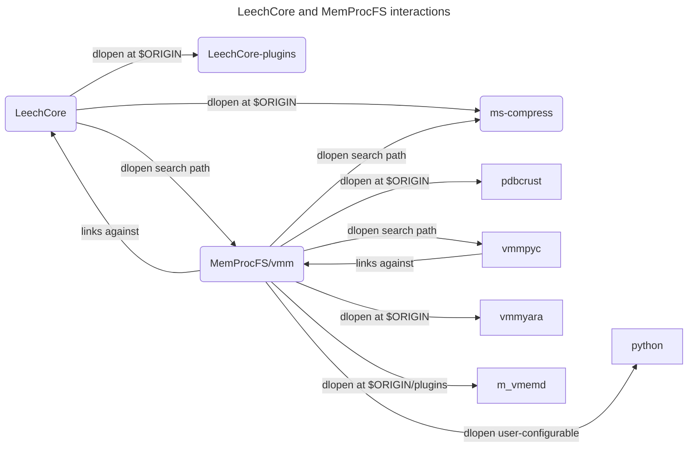

# PCILeech, MemProcFS and LeechCore

This project contains a [Nix flake](https://nix.dev/concepts/flakes.html) with
[Nixpkgs overlays](https://nixos.org/manual/nixpkgs/stable/#chap-overlays) that
provide packages for [PCILeech], [MemProcFS] and [LeechCore].

## Supported Systems

We run flake checks for the following configurations:

| 
Nix system

Nixpkgs config
 |   aarch64-linux  | x86_64-linux | aarch64-darwin | x86_64-darwin |
|-----------------------------------------------------------------------|:----------------:|:------------:|:--------------:|:-------------:|
| aarch64-unknown-linux-gnu                                             | &#x2611;&#xFE0F; |   &#x2705;   |    &#x2705;    |               |
| x86_64-unknown-linux-gnu                                              | &#x2611;&#xFE0F; |   &#x2705;   |    &#x2705;    |               |
| i686-unknown-linux-gnu                                                | &#x2611;&#xFE0F; |   &#x2705;   |    &#x2705;    |               |

The primary development machine is `aarch64-linux` system, however, GitHub
Actions CI does not provide AArch64 runners on Linux and Apple Silicon runners
lack nested virtualization support.

## System Dependencies

MemProcFS VMM bundles SQLite and miniz dependencies with hard-coded `#include`
paths. Currently, we do not patch the code to use packages from Nixpkgs.

## Optional Dependencies

LeechCore and MemProcFS have non-trivial interactions between installed shared
libraries. There is also cyclic dependency between `libleechcore.so` and
`libvmm.so` (LeechCore dynamically loads MemProcFS’s Virtual Memory Management
library that depends on LeechCore).

<dl>
  <dt>dlopen at $ORIGIN</dt>
  <dd>dlopen with absolute path below the shared object path</dd>
  <dt>dlopen search path</dt>
  <dd>dlopen with file name argument, i.e. without slash character.</dd>
  <dt>dlopen user-configurable</dt>
  <dd>dlopen with multiple candidates, including search path.</dd>
</dl>

When applicable, we apply patches to also use dlopen search path and append
dependencies to shared library RUNPATH using patchelf.

VMM users that need LeechCore VMM driver (implemented in `device_vmm.c`) should
set `LD_LIBRARY_PATH`. That is because LeechCore cannot depend on VMM to break
cyclic dependency and we want to avoid bundling these packages together.

[PCILeech]: https://github.com/ufrisk/pcileech
[MemProcFS]: https://github.com/ufrisk/MemProcFS
[LeechCore]: https://github.com/ufrisk/LeechCore
